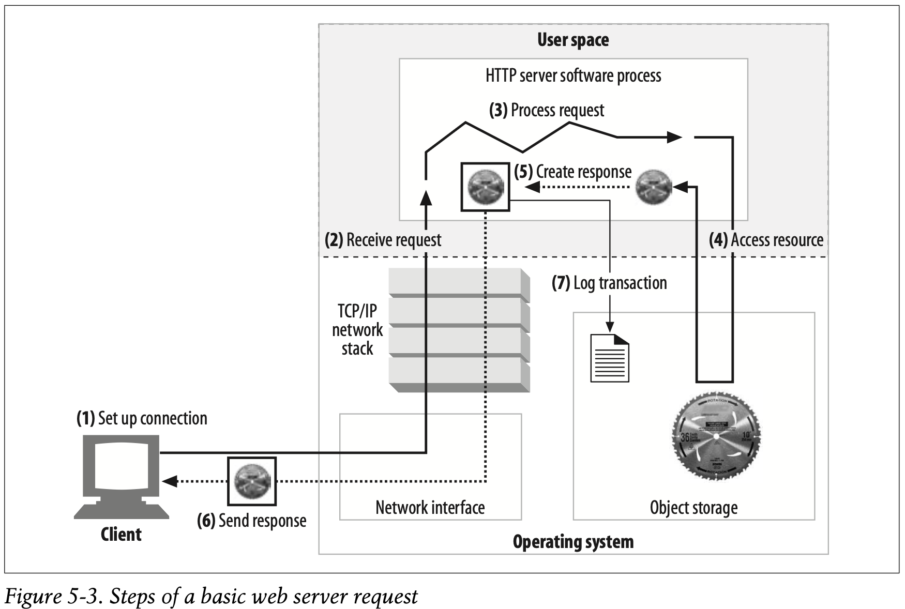

# Long Term Study - HTTP

Title: Long Term Study - HTTP - 6  
Description: Introduction to HTTP  
Resource: <HTTP: The Definitive Guide - David Gourley>  
Where At: Page 120(140 Mac Preview) - Chapter 5 - Web Servers
Author: StevenAcan <stevenacan@outlook.com>  
Date: 2025-12-26  
Version: 1.0.0  
Status: Active  
Related: e.g ( CONTRIBUTING.md, CHANGELOG.md )  
License: e.g ( MIT )

---

-- Docroots

